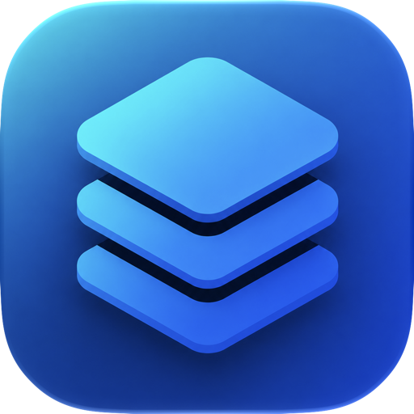

# DSContainer

**Your Synology Docker, in your pocket.**

A native iOS app for managing the Docker containers and Compose projects running on your Synology NAS — check on your stacks, restart a stuck container, and watch resource usage from anywhere, without ever opening DSM in a browser.

Synology ships polished mobile apps for most of its packages, but **Container Manager** (formerly Docker) has never had a proper mobile companion. This is it.

---

## Why it exists

Your NAS quietly runs the things you depend on — media servers, home automation, databases, side projects. When one of them goes sideways, you shouldn't have to find a laptop, log into DSM, and dig through menus. You should just pull out your phone and fix it.

DSContainer gives you exactly that: a fast, focused, native control panel for everything Docker on your Synology.

## What you can do

- **See everything at a glance** — a dashboard with live CPU, memory, storage, and how many containers are up or down.
- **Control your containers** — start, stop, restart, pause, and unpause with a tap.
- **Read the logs** — open any container and watch its logs and live CPU/memory graph in real time.
- **Manage Compose projects** — start, stop, and restart whole stacks, not just single containers.
- **Watch your NAS** — rolling CPU, memory, and network history, drawn as clean charts.
- **Get told when something breaks** — background health checks send a notification the moment a container goes down.
- **Keep multiple servers** — store all your NAS boxes and switch between them instantly.

## Built for trust

- **No cloud, no account, no tracking.** The app talks directly to your NAS and nothing else.
- **Secure by default** — HTTPS, two-factor sign-in, and self-signed certificate support for typical home setups.
- **Stays signed in the safe way** — your session lives in the iOS Keychain, so you're not re-entering 2FA every launch.

---

> Early, actively-developed project. It does real work against the real DSM WebAPI, and it's getting better every week. Widgets, Lock Screen activities, and iPad support are on the way.
